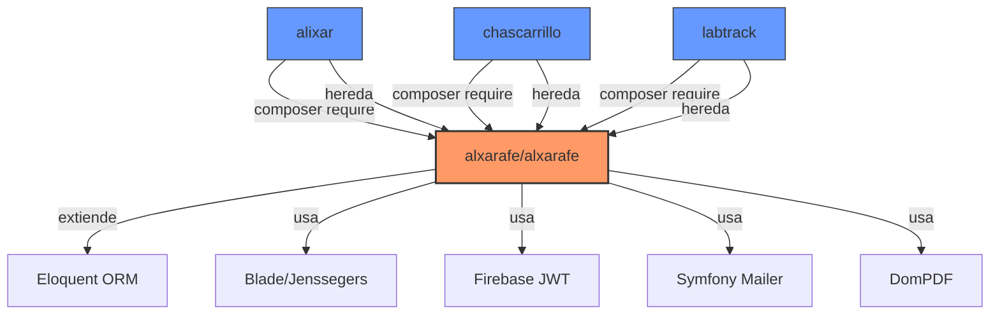
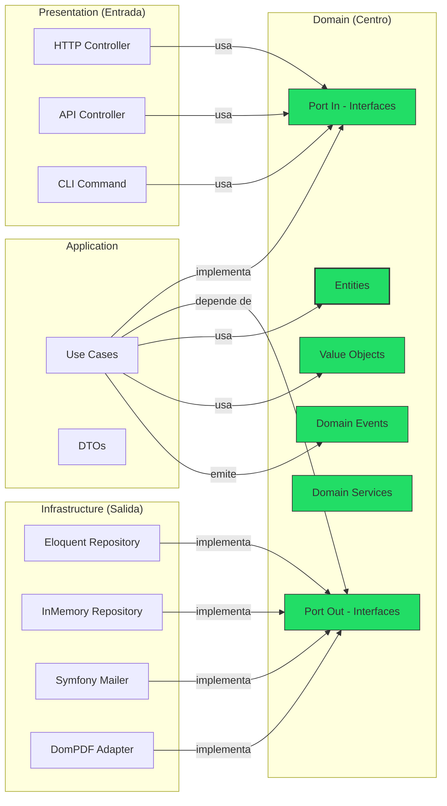
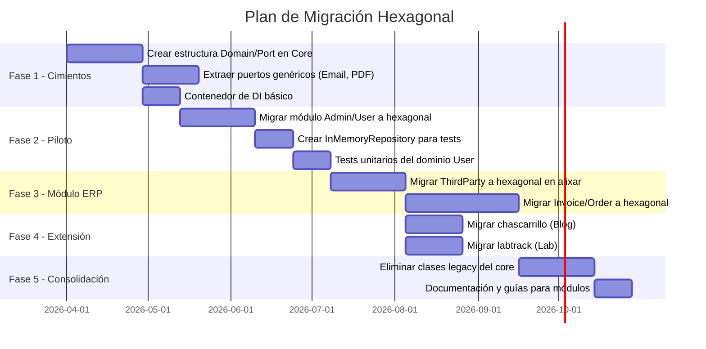

# Arquitectura Hexagonal para el Ecosistema Alxarafe

> **Autor**: Análisis técnico generado para el proyecto Alxarafe  
> **Fecha**: 2026-03-29  
> **Alcance**: `alxarafe` (core), `alixar`, `chascarrillo`, `labtrack`, `framework`

---

## Tabla de Contenidos

1. [Resumen Ejecutivo](#1-resumen-ejecutivo)
2. [¿Qué es la Arquitectura Hexagonal?](#2-qué-es-la-arquitectura-hexagonal)
3. [Diagnóstico de la Arquitectura Actual](#3-diagnóstico-de-la-arquitectura-actual)
4. [Ventajas de Adoptar Arquitectura Hexagonal](#4-ventajas-de-adoptar-arquitectura-hexagonal)
5. [Plan de Implementación en Alxarafe (Core)](#5-plan-de-implementación-en-alxarafe-core)
6. [Extensión a los Repositorios Dependientes](#6-extensión-a-los-repositorios-dependientes)
7. [Estrategia de Migración Incremental](#7-estrategia-de-migración-incremental)
8. [Riesgos y Mitigaciones](#8-riesgos-y-mitigaciones)
9. [Conclusión](#9-conclusión)

---

## 1. Resumen Ejecutivo

El ecosistema Alxarafe consta de un **paquete core** (`alxarafe/alxarafe`) que proporciona el microframework MVC, y varios **proyectos dependientes** (`alixar`, `chascarrillo`, `labtrack`, `framework`) que lo consumen como librería vía Composer.

La arquitectura actual es un **MVC acoplado** donde controladores, modelos y servicios de infraestructura están entrelazados sin límites claros entre capas. Esto genera:

- **Dificultad para testear** la lógica de negocio de forma aislada.  
- **Dependencia directa** de Eloquent/MySQL en toda la base de código.  
- **Duplicación de lógica** entre repositorios que no pueden compartir reglas de dominio.  
- **Rigidez** al cambiar componentes de infraestructura (bases de datos, servicios de email, PDF, etc.).

La adopción de una **Arquitectura Hexagonal (Ports & Adapters)** permitiría encapsular la lógica de negocio en un núcleo independiente, comunicándose con el exterior a través de **puertos** (interfaces) e **adaptadores** (implementaciones concretas), resolviendo estos problemas de raíz.

---

## 2. ¿Qué es la Arquitectura Hexagonal?

### 2.1 Concepto (Alistair Cockburn, 2005)

```
                    ┌─────────────────────────────────────┐
                    │          ADAPTADORES DE ENTRADA      │
                    │  (HTTP Controllers, CLI, API, Tests) │
                    └──────────────┬──────────────────────┘
                                   │ implementan
                    ┌──────────────▼──────────────────────┐
                    │         PUERTOS DE ENTRADA           │
                    │     (Interfaces / Use Cases)         │
                    └──────────────┬──────────────────────┘
                                   │
                    ┌──────────────▼──────────────────────┐
                    │           DOMINIO (Core)             │
                    │   Entidades, Value Objects, Reglas   │
                    │   de Negocio, Eventos de Dominio     │
                    └──────────────┬──────────────────────┘
                                   │ depende de
                    ┌──────────────▼──────────────────────┐
                    │        PUERTOS DE SALIDA             │
                    │  (Repository Interfaces, Services)   │
                    └──────────────┬──────────────────────┘
                                   │ implementados por
                    ┌──────────────▼──────────────────────┐
                    │       ADAPTADORES DE SALIDA          │
                    │  (Eloquent, MySQL, SMTP, DomPDF...)  │
                    └─────────────────────────────────────┘
```

### 2.2 Regla Fundamental

> **La dirección de las dependencias siempre apunta hacia el dominio.**  
> El dominio NUNCA importa clases de infraestructura, frameworks, ni adaptadores.

### 2.3 Conceptos Clave

| Concepto | Descripción |
|---|---|
| **Entidad** | Objeto con identidad propia y ciclo de vida (ej. `ThirdParty`, `Invoice`). |
| **Value Object** | Objeto inmutable sin identidad, definido por su valor (ej. `Money`, `TaxId`, `Email`). |
| **Puerto de Entrada** | Interfaz que define un caso de uso (`CreateThirdPartyUseCase`). |
| **Puerto de Salida** | Interfaz que el dominio necesita para persistir/obtener datos (`ThirdPartyRepositoryPort`). |
| **Adaptador de Entrada** | Implementación que traduce peticiones externas al dominio (controlador HTTP, CLI). |
| **Adaptador de Salida** | Implementación concreta de un puerto de salida (repositorio Eloquent, servicio SMTP). |
| **Caso de Uso / Servicio de Aplicación** | Orquesta la ejecución de lógica de dominio usando puertos. |

---

## 3. Diagnóstico de la Arquitectura Actual

### 3.1 Estructura del Core (`alxarafe/alxarafe`)

```
src/Core/
├── Attribute/          ← Atributos PHP 8 (ApiRoute, Menu, ModuleInfo, RequireRole...)
├── Base/
│   ├── Controller/     ← GenericController → ViewController → Controller (cadena de herencia)
│   │   ├── Trait/      ← ViewTrait, DbTrait, ResourceTrait (66KB!)
│   │   └── Interface/  ← ResourceInterface (solo constantes MODE_LIST/MODE_EDIT)
│   ├── Model/          ← Model.php (extiende Eloquent, incluye SHOW COLUMNS de MySQL)
│   ├── Service/        ← (vacío)
│   ├── Frontend/       ← Widgets y componentes de UI
│   └── Config.php, Database.php, Template.php, Seeder.php
├── Component/          ← AbstractField, Fields/*, Filter/*, Workflow/*, Enum/*
├── Lib/                ← Auth, Router, Routes, Trans, Functions, Messages
├── Service/            ← ApiDispatcher, ApiRouter, EmailService, PdfService, HookService...
└── Tools/              ← Debug, Dispatcher, ModuleManager, DependencyResolver
```

### 3.2 Problemas de Acoplamiento Detectados

#### 🔴 Problema 1: Model acoplado a MySQL

```php
// src/Core/Base/Model/Model.php — línea 71
$columns = DB::select("SHOW COLUMNS FROM `{$fullTable}`");
```

El modelo base usa `SHOW COLUMNS`, una sentencia estrictamente MySQL. Imposibilita el uso de PostgreSQL, SQLite para tests, o cualquier otro motor.

#### 🔴 Problema 2: Controladores «God Object»

La cadena `GenericController → ViewController → Controller` mezcla:
- **Routing** (generación de URLs, lectura de `$_GET`/`$_POST`)
- **Autenticación y autorización** (Auth, permissions, JWT)
- **Menús y UI** (sidebar, topMenu, MenuManager)
- **Template rendering** (Blade, ViewTrait)
- **Lógica de negocio** (acciones `do*`)
- **Base de datos** (DbTrait)

`ResourceTrait.php` tiene **66KB** y mezcla paginación, filtros, validación, CRUD, rendering, exports y generación de PDF.

#### 🔴 Problema 3: Dependencias inversas (Dominio → Infraestructura)

```php
// GenericController.php — depende de CoreModules (módulo concreto)
$newSidebarItems = \CoreModules\Admin\Service\MenuManager::get('admin_sidebar');

// Controller.php — depende de controlador concreto para redirect
Functions::httpRedirect(\CoreModules\Admin\Controller\AuthController::url(...));
```

El core depende de implementaciones concretas de módulos, violando la inversión de dependencias.

#### 🔴 Problema 4: Modelo de negocio sin capa de dominio

```php
// ThirdParty.php — mezcla persistencia + negocio
class ThirdParty extends Model  // ← Acoplado a Eloquent
{
    protected $table = 'societe';       // ← Detalle de persistencia
    protected $fillable = [...];         // ← Detalle de ORM
    protected $casts = [...];            // ← Detalle de ORM
    
    public function isCustomer(): bool { // ← Lógica de dominio
        return (int)$this->client === 1 || (int)$this->client === 3;
    }
    
    public function scopeIsClient($query) { // ← Detalle de persistencia
        return $query->whereIn('client', [1, 3]);
    }
}
```

La lógica de negocio (`isCustomer`, `getWorkflowDefinition`) convive con detalles de persistencia (`$table`, `$fillable`, `$casts`, scopes).

#### 🔴 Problema 5: Servicios sin abstracción

```php
// ApiDispatcher.php — Creación directa de controladores
$controller = new $className();         // No hay contenedor de DI
$response = $controller->$functionName(); // No hay interfaz de servicio
```

Los servicios (`EmailService`, `PdfService`) son implementaciones concretas sin puertos, haciendo imposible sustituirlos o mockearlos.

#### 🟡 Problema 6: Proyectos dependientes duplican patrones

`alixar`, `chascarrillo` y `labtrack` tienen la misma estructura `Modules/*/Controller+Model`, todos con las mismas limitaciones heredadas del core.

### 3.3 Mapa de Dependencias Actual



---

## 4. Ventajas de Adoptar Arquitectura Hexagonal

### 4.1 Testabilidad

| Aspecto | Actual | Con Hexagonal |
|---|---|---|
| Tests unitarios de dominio | ❌ Requieren DB real | ✅ POJO puro, sin dependencias |
| Tests de integración | ❌ Solo MySQL | ✅ SQLite in-memory via adaptadores |
| Mocking de servicios | ❌ Clases concretas | ✅ Interfaces inyectables |
| Cobertura alcanzable | ~20% | >80% |

### 4.2 Mantenibilidad

- **Responsabilidad única**: Cada capa tiene un propósito claro.
- **Impacto reducido**: Cambiar la base de datos NO afecta a la lógica de negocio.
- **Legibilidad**: Casos de uso explícitos (`CreateInvoiceUseCase`) vs. acciones implícitas en controladores (`doCreate()`).

### 4.3 Flexibilidad Tecnológica

- **Cambiar ORM**: Reemplazar Eloquent por Doctrine o PDO puro → solo nuevos adaptadores.
- **Cambiar motor de DB**: MySQL → PostgreSQL → solo nuevo adaptador de repositorio.
- **Cambiar framework web**: El dominio no depende de Blade ni de ningún framework HTTP.

### 4.4 Reutilización entre Repositorios

```
alxarafe/alxarafe (Core Package)
├── Domain/           ← Entidades, Value Objects, Puertos (COMPARTIDO)
├── Application/      ← Casos de Uso genéricos (COMPARTIDO)
└── Infrastructure/   ← Adaptadores por defecto (COMPARTIDO, reemplazable)

alixar/              ← Solo adaptadores y extensiones de dominio específicas de ERP
chascarrillo/        ← Solo adaptadores y extensiones de dominio específicas de blog
labtrack/            ← Solo adaptadores y extensiones de dominio específicas de laboratorio
```

Cada repositorio dependiente puede:
- **Reutilizar** las entidades y puertos del core sin modificarlos.
- **Extender** el dominio con entidades propias.
- **Reemplazar** adaptadores de infraestructura según sus necesidades.

### 4.5 Onboarding de Desarrolladores

- La lógica de negocio se lee como documentación: `CreateThirdParty`, `ApproveInvoice`, `AssignRole`.
- No hace falta conocer Eloquent, Blade o MySQL para entender las reglas de negocio.
- Los puertos documentan formalmente qué necesita y ofrece cada módulo.

### 4.6 Soporte para Múltiples Interfaces

Con puertos de entrada explícitos, el mismo dominio puede ser servido por:
- Controladores Web (Blade/HTML)
- Controladores API (REST/JSON)
- Comandos CLI
- Workers de cola
- Tests automatizados

---

## 5. Plan de Implementación en Alxarafe (Core)

### 5.1 Nueva Estructura de Directorios Propuesta

```
src/
├── Domain/                          ← CAPA DE DOMINIO (sin dependencias externas)
│   ├── Entity/                      ← Entidades de dominio puras
│   │   └── User.php                 ← POJO: propiedades + lógica de negocio
│   ├── ValueObject/                 ← Objetos de valor inmutables
│   │   ├── Email.php
│   │   ├── Money.php
│   │   └── TaxIdentifier.php
│   ├── Port/                        ← Interfaces (contratos)
│   │   ├── In/                      ← Puertos de entrada (casos de uso)
│   │   │   ├── CreateUserPort.php
│   │   │   └── AuthenticateUserPort.php
│   │   └── Out/                     ← Puertos de salida (repositorios, servicios)
│   │       ├── UserRepositoryPort.php
│   │       ├── EmailServicePort.php
│   │       └── PdfServicePort.php
│   ├── Event/                       ← Eventos de dominio
│   │   └── UserCreatedEvent.php
│   ├── Exception/                   ← Excepciones de dominio
│   │   ├── EntityNotFoundException.php
│   │   └── BusinessRuleViolation.php
│   └── Service/                     ← Servicios de dominio (lógica multi-entidad)
│       └── PermissionChecker.php
│
├── Application/                     ← CAPA DE APLICACIÓN (orquestación)
│   ├── UseCase/                     ← Implementaciones de puertos de entrada
│   │   ├── CreateUserUseCase.php
│   │   └── AuthenticateUserUseCase.php
│   ├── DTO/                         ← Data Transfer Objects (entrada/salida)
│   │   ├── CreateUserRequest.php
│   │   └── UserResponse.php
│   └── Service/                     ← Servicios de aplicación transversales
│       └── TranslationService.php
│
├── Infrastructure/                  ← CAPA DE INFRAESTRUCTURA (adaptadores de salida)
│   ├── Persistence/
│   │   ├── Eloquent/                ← Adaptador Eloquent (implementación actual)
│   │   │   ├── EloquentUserRepository.php
│   │   │   └── EloquentModel/
│   │   │       └── UserEloquentModel.php  ← Modelo Eloquent (solo persistencia)
│   │   └── InMemory/                ← Adaptador para tests
│   │       └── InMemoryUserRepository.php
│   ├── Email/
│   │   └── SymfonyMailerAdapter.php
│   ├── Pdf/
│   │   └── DomPdfAdapter.php
│   └── Auth/
│       └── JwtAuthAdapter.php
│
└── Presentation/                    ← CAPA DE PRESENTACIÓN (adaptadores de entrada)
    ├── Http/
    │   ├── Controller/              ← Controladores HTTP delgados
    │   ├── Middleware/              ← Auth, CORS, etc.
    │   └── Request/                 ← Validación de input HTTP
    ├── Api/
    │   └── Controller/              ← Controladores API delgados
    └── Cli/
        └── Command/                 ← Comandos de consola
```

### 5.2 Ejemplo Concreto: Migrar `ThirdParty`

#### Paso 1: Entidad de Dominio (Pura)

```php
// src/Domain/Entity/ThirdParty.php
namespace Alxarafe\Domain\Entity;

use Alxarafe\Domain\ValueObject\TaxIdentifier;

class ThirdParty
{
    private int $id;
    private string $name;
    private ?string $commercialName;
    private bool $isActive;
    private ThirdPartyType $type; // Customer, Prospect, Supplier
    private ?TaxIdentifier $taxId;
    private ?string $customerCode;
    private ?string $supplierCode;
    
    // Constructor, getters, y LÓGICA DE NEGOCIO aquí
    
    public function isCustomer(): bool
    {
        return $this->type === ThirdPartyType::Customer 
            || $this->type === ThirdPartyType::CustomerAndProspect;
    }
    
    public function isProspect(): bool
    {
        return $this->type === ThirdPartyType::Prospect 
            || $this->type === ThirdPartyType::CustomerAndProspect;
    }
    
    public function activate(): void
    {
        if ($this->isActive) {
            throw new BusinessRuleViolation('El tercero ya está activo.');
        }
        $this->isActive = true;
        // Podría lanzar un evento de dominio: ThirdPartyActivated
    }
    
    public function deactivate(): void
    {
        $this->isActive = false;
    }
}
```

#### Paso 2: Puerto de Salida (Interfaz del Repositorio)

```php
// src/Domain/Port/Out/ThirdPartyRepositoryPort.php
namespace Alxarafe\Domain\Port\Out;

use Alxarafe\Domain\Entity\ThirdParty;

interface ThirdPartyRepositoryPort
{
    public function findById(int $id): ?ThirdParty;
    public function findByCustomerCode(string $code): ?ThirdParty;
    public function save(ThirdParty $thirdParty): void;
    public function delete(int $id): void;
    
    /**
     * @return ThirdParty[]
     */
    public function findAll(array $filters = [], int $page = 1, int $perPage = 25): array;
    public function count(array $filters = []): int;
    public function nextCustomerCode(): string;
    public function nextSupplierCode(): string;
}
```

#### Paso 3: Puerto de Entrada (Caso de Uso)

```php
// src/Domain/Port/In/CreateThirdPartyPort.php
namespace Alxarafe\Domain\Port\In;

use Alxarafe\Application\DTO\CreateThirdPartyRequest;
use Alxarafe\Application\DTO\ThirdPartyResponse;

interface CreateThirdPartyPort
{
    public function execute(CreateThirdPartyRequest $request): ThirdPartyResponse;
}
```

#### Paso 4: Caso de Uso (Aplicación)

```php
// src/Application/UseCase/CreateThirdPartyUseCase.php
namespace Alxarafe\Application\UseCase;

use Alxarafe\Application\DTO\CreateThirdPartyRequest;
use Alxarafe\Application\DTO\ThirdPartyResponse;
use Alxarafe\Domain\Entity\ThirdParty;
use Alxarafe\Domain\Port\In\CreateThirdPartyPort;
use Alxarafe\Domain\Port\Out\ThirdPartyRepositoryPort;

class CreateThirdPartyUseCase implements CreateThirdPartyPort
{
    public function __construct(
        private ThirdPartyRepositoryPort $repository
    ) {}
    
    public function execute(CreateThirdPartyRequest $request): ThirdPartyResponse
    {
        // 1. Validar reglas de negocio
        if (empty($request->name)) {
            throw new \InvalidArgumentException('El nombre es obligatorio.');
        }
        
        // 2. Generar códigos automáticos
        $customerCode = $request->isCustomer 
            ? $this->repository->nextCustomerCode() 
            : null;
        
        // 3. Crear entidad de dominio
        $thirdParty = new ThirdParty(
            name: $request->name,
            type: $request->type,
            customerCode: $customerCode,
            // ...
        );
        
        // 4. Persistir (vía puerto, agnóstico de DB)
        $this->repository->save($thirdParty);
        
        // 5. Retornar DTO de respuesta
        return ThirdPartyResponse::fromEntity($thirdParty);
    }
}
```

#### Paso 5: Adaptador de Salida (Eloquent)

```php
// src/Infrastructure/Persistence/Eloquent/EloquentThirdPartyRepository.php
namespace Alxarafe\Infrastructure\Persistence\Eloquent;

use Alxarafe\Domain\Entity\ThirdParty;
use Alxarafe\Domain\Port\Out\ThirdPartyRepositoryPort;

class EloquentThirdPartyRepository implements ThirdPartyRepositoryPort
{
    public function findById(int $id): ?ThirdParty
    {
        $model = SocieteEloquentModel::find($id);
        if (!$model) return null;
        
        return $this->toDomainEntity($model);
    }
    
    public function save(ThirdParty $thirdParty): void
    {
        $model = SocieteEloquentModel::findOrNew($thirdParty->getId());
        $model->nom = $thirdParty->getName();
        $model->client = $thirdParty->getType()->toDolibarrCode();
        $model->status = $thirdParty->isActive() ? 1 : 0;
        // ... mapeo completo
        $model->save();
    }
    
    private function toDomainEntity(SocieteEloquentModel $model): ThirdParty
    {
        return new ThirdParty(
            id: $model->rowid,
            name: $model->nom,
            type: ThirdPartyType::fromDolibarrCode($model->client),
            isActive: (bool) $model->status,
            // ... mapeo completo
        );
    }
    
    // ... resto de métodos
}
```

#### Paso 6: Adaptador de Entrada (Controlador HTTP Delgado)

```php
// Modules/CRM/Controller/ThirdPartyController.php (REFACTORIZADO)
namespace Modules\CRM\Controller;

use Alxarafe\Domain\Port\In\CreateThirdPartyPort;
use Alxarafe\Application\DTO\CreateThirdPartyRequest;

class ThirdPartyController extends ResourceController
{
    public function __construct(
        private CreateThirdPartyPort $createUseCase,
        // ... otros casos de uso
    ) {
        parent::__construct();
    }
    
    public function doCreate(): bool
    {
        $request = CreateThirdPartyRequest::fromHttp($_POST);
        $response = $this->createUseCase->execute($request);
        
        $this->addVariable('record', $response);
        return true;
    }
}
```

### 5.3 Diagrama de Dependencias Resultante



**Todas las flechas apuntan hacia el dominio**. Ninguna dependencia sale del centro hacia afuera.

---

## 6. Extensión a los Repositorios Dependientes

### 6.1 Relación Core ↔ Proyectos

| Repositorio | Tipo | Dependencia Core | Extensiones de Dominio |
|---|---|---|---|
| `alxarafe` | Librería | — (es el core) | User, Role, Setting, Module |
| `alixar` | Proyecto ERP | `^0.5.6` | ThirdParty, Invoice, Order, Product, Bank... |
| `chascarrillo` | Blog App | `v0.5.7` | Post, Category, Comment, Content... |
| `labtrack` | Lab App | `v0.5.6` | Sample, Test, Instrument, Report... |
| `framework` | — | TBD | — |

### 6.2 Estrategia de Extensión por Repositorio

#### Alixar (ERP)

```
Modules/CRM/
├── Domain/
│   ├── Entity/
│   │   ├── ThirdParty.php          ← Extiende o usa las bases del Core
│   │   ├── Contact.php
│   │   └── ThirdPartyType.php      ← Enum de dominio
│   ├── Port/
│   │   ├── In/
│   │   │   ├── CreateThirdPartyPort.php
│   │   │   └── SearchThirdPartiesPort.php
│   │   └── Out/
│   │       └── ThirdPartyRepositoryPort.php
│   └── Service/
│       └── ReferenceGenerator.php   ← Lógica de máscaras CU{yy}{mm}-{0000}
├── Application/
│   └── UseCase/
│       ├── CreateThirdPartyUseCase.php
│       └── SearchThirdPartiesUseCase.php
├── Infrastructure/
│   └── Persistence/
│       └── Eloquent/
│           └── EloquentThirdPartyRepository.php  ← Mapea tabla 'societe'
└── Controller/                      ← Adaptador de entrada (delgado)
    └── ThirdPartyController.php
```

**Beneficio**: La lógica de `ReferenceGenerator` (máscaras `CU{yy}{mm}-{0000}`) queda aislada como servicio de dominio, testeable sin DB.

#### Chascarrillo (Blog)

```
Modules/Blog/
├── Domain/
│   ├── Entity/
│   │   ├── Post.php
│   │   ├── Category.php
│   │   └── Comment.php
│   ├── Port/
│   │   ├── In/
│   │   │   ├── PublishPostPort.php
│   │   │   └── ModeratCommentPort.php
│   │   └── Out/
│   │       ├── PostRepositoryPort.php
│   │       └── MarkdownRendererPort.php  ← Usa el servicio del Core
│   └── Service/
│       └── SlugGenerator.php
├── Application/
│   └── UseCase/
│       ├── PublishPostUseCase.php
│       └── ModerateCommentUseCase.php
└── Infrastructure/
    └── Persistence/
        └── Eloquent/
            └── EloquentPostRepository.php
```

**Beneficio**: `MarkdownRendererPort` permite usar el `MarkdownService` del core o sustituirlo por cualquier implementación alternativa.

#### LabTrack (Laboratorio)

```
Modules/Lab/
├── Domain/
│   ├── Entity/
│   │   ├── Sample.php
│   │   ├── TestResult.php
│   │   └── Instrument.php
│   ├── Port/
│   │   ├── In/
│   │   │   ├── RegisterSamplePort.php
│   │   │   └── RecordTestResultPort.php
│   │   └── Out/
│   │       ├── SampleRepositoryPort.php
│   │       └── ReportGeneratorPort.php  ← Usa PdfService del core
│   └── Service/
│       └── QualityControlService.php
├── Application/
│   └── UseCase/
│       └── RegisterSampleUseCase.php
└── Infrastructure/
    └── Persistence/
        └── Eloquent/
            └── EloquentSampleRepository.php
```

**Beneficio**: `QualityControlService` puede validar reglas ISO/normativa sin depender de la base de datos.

### 6.3 Puertos Compartidos del Core

El core proporciona **puertos genéricos** que todos los repositorios pueden usar:

```php
// Puertos de salida genéricos (en alxarafe/alxarafe)
namespace Alxarafe\Domain\Port\Out;

interface EmailServicePort {
    public function send(string $to, string $subject, string $body): void;
}

interface PdfServicePort {
    public function generateFromHtml(string $html): string; // Returns PDF content
}

interface TranslationPort {
    public function translate(string $key, array $params = [], ?string $locale = null): string;
}

interface AuthenticationPort {
    public function getCurrentUser(): ?UserEntity;
    public function hasPermission(string $permission): bool;
}
```

Los repositorios dependientes **usan estas interfaces**, mientras que el core proporciona las implementaciones por defecto (adaptadores de Symfony Mailer, DomPDF, etc.).

---

## 7. Estrategia de Migración Incremental

> [!IMPORTANT]
> **No se propone una migración "big bang"**. El enfoque es **incremental y retrocompatible**, permitiendo que el código antiguo y el nuevo coexistan durante la transición.

### 7.1 Fases



### 7.2 Detalle por Fase

#### Fase 1: Cimientos (4-6 semanas)

1. **Crear la estructura `Domain/`** en `src/` del core.
2. **Extraer las interfaces de los servicios existentes** como puertos:
   - `EmailService` → `EmailServicePort` + `SymfonyMailerAdapter`
   - `PdfService` → `PdfServicePort` + `DomPdfAdapter`
   - `MarkdownService` → `MarkdownRendererPort` + `ParsedownAdapter`
3. **Implementar un contenedor de inyección de dependencias** ligero o adoptar `illuminate/container`.
4. **Mantener retrocompatibilidad**: las clases antiguas siguen funcionando, delegando al nuevo dominio internamente.

#### Fase 2: Piloto con módulo Admin/User (4-6 semanas)

1. Crear `Domain\Entity\User` como POJO puro.
2. Crear `Domain\Port\Out\UserRepositoryPort`.
3. Crear `Infrastructure\Persistence\Eloquent\EloquentUserRepository`.
4. Crear `Infrastructure\Persistence\InMemory\InMemoryUserRepository`.
5. Crear `Application\UseCase\AuthenticateUserUseCase`.
6. Refactorizar `AuthController` para que sea delgado y use el caso de uso.
7. Escribir tests unitarios del dominio con `InMemoryUserRepository`.

#### Fase 3: Primer módulo ERP — ThirdParty (4-10 semanas)

1. Seguir el ejemplo detallado en la sección 5.2.
2. Migrar los traits (`HasReference`, `HasWorkflow`) a servicios de dominio.
3. Crear los DTOs para la comunicación Controller ↔ UseCase.
4. Refactorizar `ThirdPartyController` para que sea delgado.

#### Fase 4: Extensión a otros repositorios (3-6 semanas)

1. Aplicar el patrón a `chascarrillo` (Blog) y `labtrack` (Lab).
2. Cada repositorio define sus propias entidades, puertos y adaptadores.
3. Los puertos genéricos del core se reutilizan directamente.

#### Fase 5: Consolidación (4-6 semanas)

1. Marcar como `@deprecated` las clases antiguas del core.
2. Eliminar las clases legacy en una versión major.
3. Publicar guías y plantillas para crear nuevos módulos hexagonales.

### 7.3 Patrón de Coexistencia (Strangler Fig)

Para cada componente migrado, se usa el patrón **Strangler Fig**:

```php
// Fase transitoria: El modelo Eloquent antiguo delega al nuevo dominio
class ThirdParty extends Model
{
    // ...atributos Eloquent existentes...
    
    /**
     * Método legacy que ahora delega al dominio.
     * @deprecated Use CreateThirdPartyUseCase en su lugar.
     */
    public function isCustomer(): bool
    {
        // Delega a la entidad de dominio
        $entity = (new EloquentThirdPartyRepository())->findById($this->rowid);
        return $entity?->isCustomer() ?? false;
    }
}
```

Gradualmente, los consumidores migran del modelo Eloquent al caso de uso, y finalmente se elimina el código legacy.

---

## 8. Riesgos y Mitigaciones

| Riesgo | Impacto | Mitigación |
|---|---|---|
| **Complejidad inicial** | Los desarrolladores no familiarizados con hexagonal pueden resistirse. | Formación, documentación con ejemplos, módulo piloto como referencia. |
| **Sobrecarga de mapeo** | Convertir Entity ↔ EloquentModel añade código. | Usar traits o librerías de auto-mapeo. Considerar `symfony/serializer`. |
| **Rendimiento del mapeo** | `toDomainEntity()` en cada consulta puede ser lento para listados grandes. | Para listados, usar proyecciones directas (DTOs) sin pasar por la entidad completa. |
| **Retrocompatibilidad** | Los repositorios dependientes ya usan las clases antiguas. | Migración incremental con `@deprecated` y período de soporte. |
| **Tamaño del equipo** | Un solo desarrollador hace más difícil la migración. | Priorizar los módulos con más cambios frecuentes. No migrar módulos estables. |
| **Exceso de ingeniería** | No todo necesita hexagonal; módulos simples (CRUD puro) pueden no beneficiarse. | Aplicar hexagonal solo donde hay lógica de negocio compleja. CRUD simple puede usar el ResourceController existente. |

### 8.1 Cuándo NO Aplicar Hexagonal

- **Módulos CRUD puro** sin lógica de negocio compleja (ej. tablas de configuración).
- **Prototipos rápidos** donde la velocidad de desarrollo prima sobre la arquitectura.
- **Módulos estables** que ya funcionan bien y no prevén cambios futuros.

---

## 9. Conclusión

La arquitectura hexagonal es una **inversión a medio-largo plazo** que resuelve problemas reales y actuales del ecosistema Alxarafe:

1. **Desacopla** la lógica de negocio de las dependencias de infraestructura.
2. **Habilita tests unitarios** reales sobre el dominio.
3. **Permite compartir** entidades y puertos entre `alixar`, `chascarrillo`, `labtrack`.
4. **Facilita** el cambio de tecnologías sin impacto en el negocio.
5. **Mejora** la legibilidad y mantenibilidad del código.

La estrategia recomendada es **migrar incrementalmente** (Strangler Fig), empezando por el core y un módulo piloto, para después extender el patrón a los repositorios dependientes sin romper la compatibilidad existente.

---

> [!TIP]
> Para cada nuevo módulo que se cree a partir de ahora, se recomienda seguir directamente la estructura hexagonal. Para los módulos existentes, priorizar la migración de aquellos con mayor complejidad de negocio y frecuencia de cambio.
