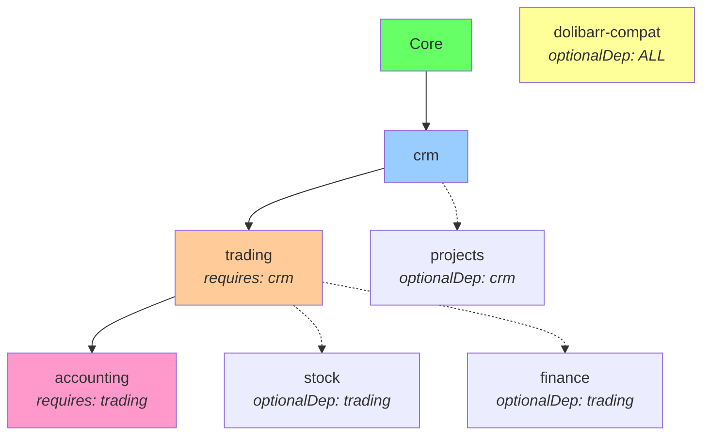
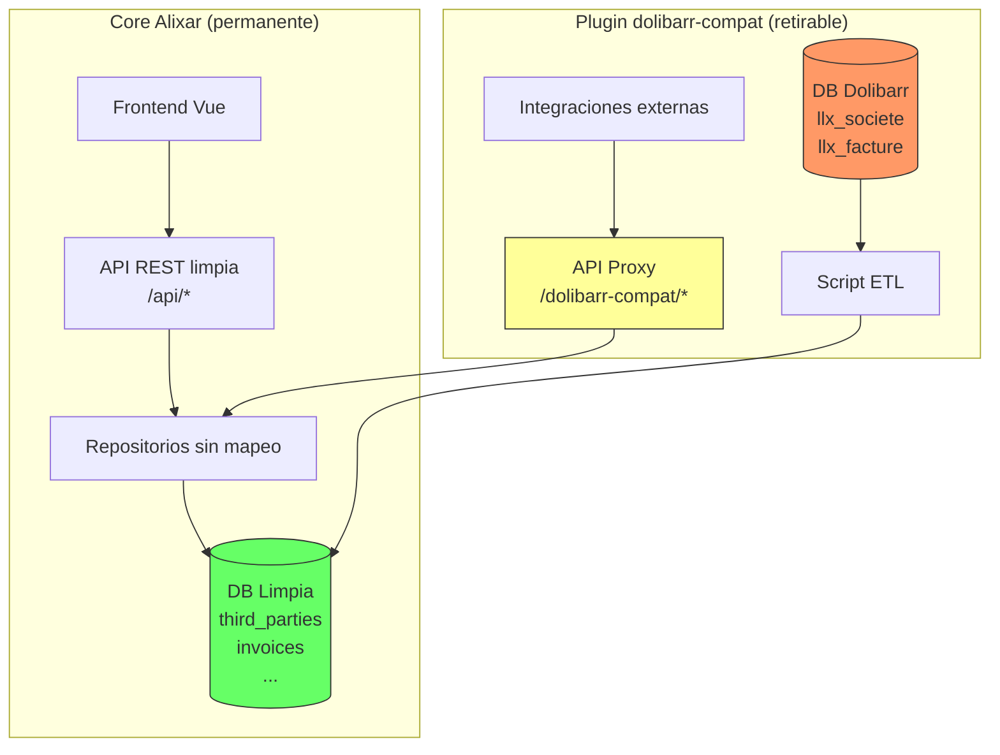
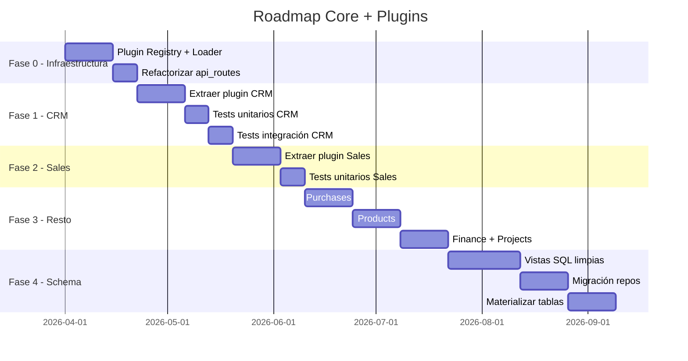

# Informe de Viabilidad: Arquitectura Modular Core + Plugins para Alixar

> **Autor**: Análisis técnico generado para el proyecto Alixar  
> **Fecha**: 2026-04-12  
> **Clasificación**: Documento estratégico — Decisión arquitectónica irreversible  
> **Veredicto**: ✅ **VIABLE y RECOMENDADO**, con condiciones

---

## Tabla de Contenidos

1. [Resumen Ejecutivo](#1-resumen-ejecutivo)
2. [Auditoría del Estado Actual](#2-auditoría-del-estado-actual)
3. [Anatomía de la Base de Datos de Dolibarr](#3-anatomía-de-la-base-de-datos-de-dolibarr)
4. [Propuesta de Arquitectura Core + Plugins](#4-propuesta-de-arquitectura-core--plugins)
5. [Estrategia de Base de Datos: ¿Partir de Dolibarr o Migrar?](#5-estrategia-de-base-de-datos-partir-de-dolibarr-o-migrar)
6. [Estrategia de Tests](#6-estrategia-de-tests)
7. [Tablas "Ruido" de Dolibarr: Análisis de Eliminación](#7-tablas-ruido-de-dolibarr-análisis-de-eliminación)
8. [Riesgos y Mitigaciones](#8-riesgos-y-mitigaciones)
9. [Roadmap de Ejecución](#9-roadmap-de-ejecución)
10. [Conclusión y Recomendación Final](#10-conclusión-y-recomendación-final)

---

## 1. Resumen Ejecutivo

### La Pregunta

> ¿Es viable separar las funcionalidades de Alixar (inspirado en Dolibarr) en un núcleo funcional + carpetas independientes (plugins), sin ser fieles a la estructura de Dolibarr?

### La Respuesta

**Sí, es viable, y de hecho es la dirección natural** del proyecto dado su estado actual. Las razones:

1. **Ya estáis parcialmente ahí.** La capa hexagonal en `src/` ya desacopla dominio de infraestructura para 12 bounded contexts. Los repositorios MySQL ya mapean entre nombres Dolibarr y nombres limpios de dominio.

2. **Dolibarr no es modular.** Dolibarr tiene 403 tablas SQL, pero NO tiene una separación limpia en módulos. Las tablas se cruzan entre sí de forma caótica (categorías, extrafields, element_element, element_contact — todos son tablas puente "catch-all").

3. **El frontend ya está desacoplado.** Vue + API REST headless significa que el frontend no depende de la estructura de carpetas del backend. Los schemas JSON ya definen cada módulo de forma independiente.

4. **La inversión se amortiza rápidamente.** Cada plugin bien definido es testable, desplegable y documentable de forma independiente.

### Principio Rector

> **El esquema limpio es la verdad. Dolibarr es el adaptado, no al revés.**

El core y los plugins trabajan sobre tablas limpias desde el día 1 (`third_parties`, `invoices`, etc.).
Una **capa Anti-Corruption Layer (ACL)** externa se encarga de:
- Migrar datos desde una DB Dolibarr existente (ETL one-shot).
- Opcionalmente, exponer una API compatible Dolibarr para la transición.

---

## 2. Auditoría del Estado Actual

### 2.1 Arquitectura Hexagonal Ya Implementada

El proyecto ya tiene la semilla de la arquitectura modular:

```
src/
├── Domain/                    ← 15 bounded contexts
│   ├── ThirdParty/            ← Entity, Repository, Validator, Enums
│   ├── Contact/               ← Entity, Repository, NotFoundException
│   ├── Invoice/               ← Entity, Lines, Status, Type, Repository
│   ├── Order/                 ← (mismo patrón)
│   ├── Product/
│   ├── Proposal/
│   ├── Project/
│   ├── BankAccount/
│   ├── Event/
│   ├── SupplierInvoice/
│   ├── SupplierOrder/
│   ├── Category/
│   ├── Menu/
│   ├── User/
│   └── Exception/
├── Application/               ← Puertos, Codificación, Configuración
│   ├── Configuration/         ← ConfigurationPort (lee llx_const)
│   ├── Codification/          ← Generadores de código
│   └── Menu/                  ← GetNavigationTree
└── Infrastructure/            ← Adaptadores MySQL + HTTP
    ├── DolibarrMappingTrait   ← Traductor columnas Dolibarr ↔ Dominio
    ├── Persistence/Mysql/     ← 13 repositorios PDO
    └── Http/Api/Controller/   ← Controladores API (FlightPHP)
```

> [!IMPORTANT]
> **Observación clave:** La arquitectura actual es un **monolito hexagonal bien estructurado**. Lo que falta es **partirlo en módulos independientes** con un ciclo de vida propio (activación, tests, migración de tablas).

### 2.2 Frontend Desacoplado (Headless)

| Componente | Estado |
|---|---|
| Vue 3 SPA | ✅ Independiente del backend PHP |
| 11 schemas JSON (SDUI) | ✅ Cada módulo se autodefine |
| 13 vistas con detail/list | ✅ Una carpeta por módulo funcional |
| GenericFichaTab (SDUI) | ✅ Motor de renderizado universal |
| API REST (FlightPHP) | ✅ 289 líneas de rutas, ~80 endpoints |

### 2.3 Dependencia del Core de Alxarafe (Framework)

```json
// composer.json
"require": {
    "alxarafe/alxarafe": "^0.6.0",  // ← Framework MVC legacy
    "flightphp/core": "^3.0"         // ← API REST headless
}
```

Alixar declara dependencia de **dos sistemas**, pero tras verificar el código:

| Componente | ¿Usa Alxarafe? | ¿Usa FlightPHP? |
|---|---|---|
| `src/Domain/` (entidades) | ❌ Cero imports | ❌ Cero imports |
| `src/Infrastructure/Persistence/` (repos) | ❌ PDO puro | ❌ |
| `src/Infrastructure/Http/Api/` (controllers) | ❌ | ✅ `Flight::json()` |
| `config/api.php` + `api_routes.php` | ❌ | ✅ |
| `Modules/Alixar/` (interfaz web legacy) | ✅ Blade, Eloquent, ResourceController | ❌ |

> [!TIP]
> **La capa hexagonal (`src/` + API) tiene CERO dependencias de Alxarafe.**
> La búsqueda `use Alxarafe\*` en `src/` devuelve 0 resultados.
> Se puede eliminar `alxarafe/alxarafe` del `composer.json` sin afectar la API.
>
> Alxarafe solo es necesario para la interfaz web legacy (`Modules/Alixar/`).
> En la nueva arquitectura de plugins, **Alxarafe no participa**.

---

## 3. Anatomía de la Base de Datos de Dolibarr

### 3.1 Cifras Brutas

He analizado los **403 archivos SQL** de definición de tablas en el instalador de Dolibarr que tenéis en `tmp/dolibarr/htdocs/install/mysql/tables/`:

| Categoría | Cantidad | Descripción |
|---|---|---|
| **Tablas de diccionario** (`llx_c_*`) | 64 | Datos de referencia: países, monedas, IVA, formas jurídicas, etc. |
| **Tablas de extrafields** (`*_extrafields`) | 81 | Una tabla extra por cada entidad con campos personalizados |
| **Tablas condicionales de módulo** (sufijo `-modulo`) | 131 | Solo existen si el módulo está activo (asset, bom, bookcal, recruitment, ticket, webhook, etc.) |
| **Tablas core** (sin sufijo de módulo) | 272 | Tablas base siempre presentes |

**Total: 403 definiciones de tablas.**

### 3.2 Clasificación Funcional de las Tablas Core (sin extrafields ni diccionarios)

Las ~160 tablas restantes (core, sin `c_*` ni `_extrafields`) se organizan así:

| Dominio Funcional | Tablas Principales | Tablas Auxiliares | Total |
|---|---|---|---|
| **CRM (Terceros+Contactos)** | `societe`, `socpeople` | `societe_rib`, `societe_commerciaux`, `societe_contacts`, `societe_account`, `societe_remise`, `societe_remise_except`, `societe_remise_supplier`, `societe_prices` | ~10 |
| **Ventas** | `propal`, `propaldet`, `commande`, `commandedet`, `facture`, `facturedet` | `facture_rec`, `facturedet_rec`, `propal_merge_pdf_product` | ~9 |
| **Compras** | `commande_fournisseur`, `commande_fournisseurdet`, `facture_fourn`, `facture_fourn_det` | `facture_fourn_rec`, `facture_fourn_det_rec`, `commande_fournisseur_log`, `supplier_proposal`, `supplier_proposaldet` | ~9 |
| **Productos/Stock** | `product`, `product_stock`, `product_lot`, `product_batch` | `product_price`, `product_fournisseur_price`, `product_customer_price`, `product_association`, `product_lang`, logs de precios, `stock_mouvement`, `entrepot` | ~15 |
| **Finanzas/Banco** | `bank`, `bank_account` | `bank_url`, `paiement`, `paiement_facture`, `paiementfourn`, `paiementfourn_facturefourn`, `bordereau_cheque`, `prelevement_*` (5 tablas), `payment_various`, `payment_vat`, `payment_loan`, `payment_salary` | ~18 |
| **Contabilidad** | `accounting_account`, `accounting_journal`, `accounting_fiscalyear` | `accounting_system`, `accounting_groups_account` + 8 tablas condicionales | ~13 |
| **Proyectos** | `projet`, `projet_task` | `element_time` | ~3 |
| **RRHH** | `holiday`, `salary`, `expensereport`, `expensereport_det` | `holiday_config`, `holiday_logs`, `holiday_users`, `user_employment`, `payment_salary`, `user_rib` | ~10 |
| **Socios/Miembros** | `adherent`, `adherent_type` | `subscription`, `adherent_type_lang` | ~4 |
| **Logística** | `expedition`, `expeditiondet`, `reception`, `delivery`, `deliverydet` | `expeditiondet_batch`, `receptiondet_batch`, `expedition_package` | ~8 |
| **Contratos** | `contrat`, `contratdet` | | ~2 |
| **Intervenciones** | `fichinter`, `fichinterdet` | `fichinter_rec`, `fichinterdet_rec` | ~4 |
| **Agenda/Eventos** | `actioncomm` | `actioncomm_resources`, `actioncomm_reminder` | ~3 |
| **Sistema/Usuarios** | `user`, `usergroup`, `rights_def` | `user_rights`, `usergroup_rights`, `usergroup_user`, `user_param`, `user_alert`, `user_clicktodial` | ~10 |
| **Infraestructura** | `const`, `menu`, `boxes`, `boxes_def`, `cronjob`, `document_model`, `events`, `blockedlog` | `notify*`, `oauth_*`, `ecm_*`, `comment`, `links`, `bookmark`, `default_values`, `export_model`, `import_model`, `printing` | ~25 |
| **Tablas Puente** | `element_element`, `element_contact`, `element_resources`, `element_categorie` | `categorie_*` (15+ tablas de asociación) | ~20 |

### 3.3 Observaciones Críticas sobre la DB de Dolibarr

#### Las tablas puente son un anti-patrón endémico

Dolibarr tiene **una tabla `categorie_*` POR CADA entidad** que puede ser categorizada:

```
llx_categorie_societe       (terceros)
llx_categorie_contact       (contactos)
llx_categorie_product       (productos)
llx_categorie_fournisseur   (proveedores)
llx_categorie_project       (proyectos)
llx_categorie_member        (miembros)
llx_categorie_actioncomm    (eventos)
llx_categorie_user          (usuarios)
llx_categorie_invoice       (facturas)
llx_categorie_order         (pedidos)
llx_categorie_supplier_invoice
llx_categorie_supplier_order
... (y más)
```

**En un diseño moderno**, una sola tabla polimórfica `category_assignments(category_id, entity_type, entity_id)` reemplazaría las 15+.

Similarmente, `element_element` es una tabla puente genérica que conecta cualquier entidad con cualquier otra, pero luego Dolibarr **también tiene tablas específicas** como `societe_contacts`, `element_contact`, etc. — redundancia pura.

#### Los extrafields son ruido arquitectónico

Las **81 tablas `_extrafields`** son el mecanismo de Dolibarr para campos personalizados. Cada entidad tiene su propia tabla `_extrafields`. En un diseño moderno, esto se resuelve con:
- Una columna JSON (`custom_fields JSON`) en la propia tabla.
- O una tabla genérica `entity_custom_fields(entity_type, entity_id, field_name, field_value)`.

#### La configuración está sobrecargada

`llx_const` es una tabla key-value que almacena **toda** la configuración: desde el nombre de la empresa hasta si un módulo está activo, pasando por las máscaras de numeración. En un diseño moderno, esto se separaría en:
- `settings` (configuración general)
- `module_config` (configuración por módulo)
- `feature_flags` (activación de funcionalidades)

---

## 4. Propuesta de Arquitectura Core + Plugins

### 4.1 Estructura de Directorios Propuesta

```
alixar/
├── src/
│   └── Core/                          ← NÚCLEO (siempre cargado)
│       ├── Domain/
│       │   ├── User/                  ← Entidad User pura
│       │   ├── Setting/               ← Configuración global
│       │   ├── Menu/                  ← Sistema de menús
│       │   ├── Category/              ← Sistema genérico de categorías
│       │   └── Shared/
│       │       ├── ValueObject/       ← Money, Email, TaxId, Reference
│       │       ├── Event/             ← DomainEventInterface, EventDispatcher
│       │       ├── Exception/         ← DomainException base
│       │       └── Port/              ← Interfaces compartidas
│       ├── Application/
│       │   ├── Configuration/         ← ConfigurationPort
│       │   ├── Auth/                  ← Autenticación y autorización
│       │   └── Plugin/               ← PluginRegistry, PluginLoader
│       └── Infrastructure/
│           ├── Persistence/           ← Adaptadores base (PDO pool)
│           ├── Http/                  ← Router, Middleware, CORS
│           ├── Migration/             ← Motor de migraciones
│           └── Testing/               ← InMemory repositories base
│
├── plugins/                           ← PLUGINS (cargados bajo demanda)
│   ├── crm/                           ← Plugin CRM
│   │   ├── plugin.json               ← Manifest del plugin
│   │   ├── src/
│   │   │   ├── Domain/
│   │   │   │   ├── ThirdParty/
│   │   │   │   └── Contact/
│   │   │   ├── Application/
│   │   │   │   └── UseCase/
│   │   │   └── Infrastructure/
│   │   │       ├── Persistence/       ← MysqlThirdPartyRepository
│   │   │       └── Http/              ← ThirdPartyApiController
│   │   ├── migrations/               ← SQLs de creación de tablas
│   │   │   ├── 001_create_third_parties.sql
│   │   │   └── 002_create_contacts.sql
│   │   ├── tests/                     ← Tests unitarios + integración
│   │   │   ├── Unit/
│   │   │   └── Integration/
│   │   └── frontend/                  ← Schemas + vistas Vue (opcional)
│   │       ├── schemas/
│   │       │   └── terceros.json
│   │       └── views/
│   │           ├── ThirdPartyListView.vue
│   │           └── ThirdPartyDetailView.vue
│   │
│   ├── sales/                         ← Plugin Ventas
│   │   ├── plugin.json
│   │   ├── src/Domain/
│   │   │   ├── Proposal/
│   │   │   ├── Order/
│   │   │   └── Invoice/
│   │   ├── migrations/
│   │   ├── tests/
│   │   └── frontend/
│   │
│   ├── purchases/                     ← Plugin Compras
│   ├── products/                      ← Plugin Productos
│   ├── finance/                       ← Plugin Finanzas/Banco
│   ├── projects/                      ← Plugin Proyectos
│   ├── hrm/                           ← Plugin RRHH
│   ├── accounting/                    ← Plugin Contabilidad
│   └── stock/                         ← Plugin Stock/Logística
│
├── config/
│   ├── api.php                        ← Bootstrap API
│   ├── api_routes.php                 ← Composition root (auto-generado por plugins)
│   └── plugins.php                    ← Registro de plugins activos
│
├── frontend/                          ← SPA Vue (se mantiene)
└── tests/                             ← Tests del core
```

### 4.2 Manifest del Plugin (`plugin.json`)

Cada plugin se describe mediante un archivo `plugin.json` que permite al core descubrirlo y gestionarlo:

```json
{
  "name": "crm",
  "version": "1.0.0",
  "displayName": "CRM — Terceros y Contactos",
  "description": "Gestión de terceros (clientes, proveedores, prospectos) y sus contactos.",
  "icon": "fas fa-id-card",
  "author": "Alixar",
  
  "requires": [],
  "optionalDeps": ["products", "projects"],
  
  "provides": {
    "entities": ["ThirdParty", "Contact", "BankAccount"],
    "apiRoutes": "src/Infrastructure/Http/routes.php",
    "migrations": "migrations/",
    "schemas": "frontend/schemas/"
  },
  
  "dolibarr": {
    "tables": ["societe", "socpeople", "societe_rib", "societe_commerciaux"],
    "dictionaries": ["c_typent", "c_effectif", "c_forme_juridique", "c_stcomm", "c_prospectlevel"]
  }
}
```

### 4.3 El Plugin Sales como Ejemplo de Dependencias

```json
{
  "name": "sales",
  "displayName": "Ventas",
  "requires": ["crm"],
  "optionalDeps": ["products", "projects"],
  
  "provides": {
    "entities": ["Proposal", "Order", "Invoice", "InvoiceLine"],
    "apiRoutes": "src/Infrastructure/Http/routes.php",
    "migrations": "migrations/"
  },
  
  "dolibarr": {
    "tables": ["propal", "propaldet", "commande", "commandedet", "facture", "facturedet"],
    "dictionaries": ["c_propalst", "c_payment_term", "c_paiement", "c_input_reason"]
  }
}
```

### 4.4 Plugin Registry (Core)

El core necesita un componente central para gestionar los plugins:

```php
// src/Core/Application/Plugin/PluginRegistry.php
class PluginRegistry
{
    /** @var PluginManifest[] */
    private array $plugins = [];
    
    public function register(PluginManifest $manifest): void;
    public function isActive(string $name): bool;
    public function getActivePlugins(): array;
    public function resolveDependencies(string $name): array;
    public function getRoutes(): array;      // Agrega rutas de todos los plugins activos
    public function getMigrations(): array;  // Agrega migraciones pendientes
}
```

### 4.5 Principio de Desacoplamiento Total

> [!IMPORTANT]
> **Regla inquebrantable:** El core **NUNCA** importa código de un plugin.
> Ni un `use`, ni un `require`, ni un `new PluginClass()`.
> Si la carpeta del plugin existe **y está activo** → funciona.
> Si la carpeta no existe, o existe pero no está activo → nada se rompe.

Esto se logra con **descubrimiento dinámico + activación explícita**:
1. El core escanea `plugins/*/plugin.json` con `glob()` → **descubre** los plugins disponibles.
2. Solo los plugins marcados como **activos** (en config o DB) se cargan.
3. Si no hay plugins, o ninguno está activo, la app arranca vacía.

#### Descubrimiento de Plugins

```php
// src/Core/Application/Plugin/PluginLoader.php
class PluginLoader
{
    public function discover(string $pluginsDir): array
    {
        $plugins = [];
        foreach (glob($pluginsDir . '/*/plugin.json') as $manifest) {
            $data = json_decode(file_get_contents($manifest), true);
            $plugins[] = new PluginManifest($data, dirname($manifest));
        }
        return $plugins; // Si no hay carpetas → array vacío. Nada se rompe.
    }
}
```

#### Carga Dinámica de Rutas (sin `use`)

```php
// config/api_routes.php — genérico, no conoce ningún plugin
$loader = new PluginLoader();
$plugins = $loader->discover(__DIR__ . '/../plugins');

foreach ($plugins as $plugin) {
    if (!$plugin->isActive()) continue;
    
    // Registrar autoloader PSR-4 del plugin dinámicamente
    $plugin->registerAutoloader();
    
    // Cargar sus rutas — cada plugin devuelve un closure
    $routeFile = $plugin->getPath() . '/src/Infrastructure/Http/routes.php';
    if (file_exists($routeFile)) {
        $registerRoutes = require $routeFile;
        $registerRoutes($app, $pdo);
    }
}
```

#### Autodescubrimiento del Frontend

El frontend obtiene sus schemas y menús dinámicamente del core,
que a su vez los recopila de los plugins activos:

```php
// Core: GET /api/setup/schemas → sirve schemas de plugins activos
$app->route('GET /api/setup/schemas', function() use ($plugins) {
    $schemas = [];
    foreach ($plugins as $plugin) {
        $schemaDir = $plugin->getPath() . '/frontend/schemas';
        if (is_dir($schemaDir)) {
            foreach (glob($schemaDir . '/*.json') as $file) {
                $schemas[basename($file, '.json')] = json_decode(file_get_contents($file));
            }
        }
    }
    Flight::json($schemas);
});
```

Si un plugin no está, su schema no aparece → sus rutas y menús no existen en el frontend.

#### Contraste con el Estado Actual

| Concepto | Ahora (acoplado) | Propuesto (desacoplado) |
|---|---|---|
| `ThirdParty.php` | `src/Domain/ThirdParty/` | `plugins/crm/src/Domain/ThirdParty/` |
| Repositorio | `src/Infrastructure/Persistence/Mysql/` | `plugins/crm/src/Infrastructure/` |
| Rutas | Hardcoded en `config/api_routes.php` L50-85 | `plugins/crm/src/Infrastructure/Http/routes.php` |
| Schema JSON | `frontend/src/schemas/terceros.json` | `plugins/crm/frontend/schemas/terceros.json` |
| Si borras CRM | 💥 Fatal error | ✅ App arranca sin CRM |

### 4.6 Sistema de Hooks (Comunicación Inter-Plugin)

Los plugins NO se conocen entre sí. Pero necesitan poder inyectar comportamiento
en otros plugins o en el core. Esto se logra con un **bus de hooks** que el core
proporciona y que los plugins usan para emitir y escuchar eventos.

#### Interface del Core

```php
// src/Core/Application/Plugin/HookRegistry.php
interface HookRegistry
{
    /** Registra un listener */
    public function on(string $hook, callable $handler, int $priority = 10): void;
    
    /** Filter: cada listener modifica $data y lo devuelve */
    public function filter(string $hook, array $data): array;
    
    /** Action: los listeners reaccionan, sin devolver nada */
    public function action(string $hook, array $data): void;
}
```

#### Ejemplo: Sales inyecta pestañas en CRM

```php
// Plugin CRM: emite un hook al construir las pestañas de un tercero
// plugins/crm/src/Infrastructure/Http/ThirdPartyApiController.php
public function getTabs(int $id): void
{
    $baseTabs = [
        ['id' => 'main',     'label' => 'Ficha',     'schema' => 'terceros'],
        ['id' => 'contacts', 'label' => 'Contactos', 'schema' => 'contactos'],
    ];
    
    // Deja que OTROS plugins añadan sus pestañas
    $result = $this->hooks->filter('thirdparty.tabs', [
        'thirdPartyId' => $id,
        'tabs'         => $baseTabs,
    ]);
    
    Flight::json($result['tabs']); // CRM no sabe qué añadieron otros
}
```

```php
// Plugin Sales: ESCUCHA el hook y añade su pestaña
// plugins/sales/src/Infrastructure/Http/hooks.php
return function (HookRegistry $hooks) {
    $hooks->on('thirdparty.tabs', function (array $data): array {
        $data['tabs'][] = [
            'id'     => 'invoices',
            'label'  => 'Facturas',
            'schema' => 'facturas',
            'filter' => ['third_party_id' => $data['thirdPartyId']],
        ];
        return $data;
    });
};
```

**Si solo CRM está instalado → 2 pestañas. Si CRM + Sales → 3. Si CRM + Sales + Purchases → 4.**
El plugin CRM no ha cambiado ni una línea.

#### Hooks de Negocio (Actions)

```php
// Plugin Sales: al validar una factura, emite un action hook
$this->hooks->action('invoice.validated', [
    'invoiceId'    => $invoice->getId(),
    'ref'          => $invoice->getRef(),
    'thirdPartyId' => $invoice->getThirdPartyId(),
    'totalTtc'     => $invoice->getTotalTtc(),
]);

// Plugin Accounting: escucha y crea asiento contable
$hooks->on('invoice.validated', function (array $data): void {
    $this->journalService->createEntry(
        debit: '411000', credit: '707000',
        amount: $data['totalTtc'], label: "Factura {$data['ref']}"
    );
});
```

Si Accounting no está instalado → nadie escucha el hook → cero errores.

#### Carga de Hooks en el Bootstrap

```php
// config/api_routes.php
$hooks = new HookRegistry();

foreach ($registry->getLoadOrder() as $plugin) {
    $plugin->registerAutoloader();
    
    // 1. Cargar hooks (primero, para que estén listos)
    $hookFile = $plugin->getPath() . '/src/Infrastructure/Http/hooks.php';
    if (file_exists($hookFile)) {
        $registerHooks = require $hookFile;
        $registerHooks($hooks);
    }
    
    // 2. Cargar rutas (inyectando $hooks)
    $routeFile = $plugin->getPath() . '/src/Infrastructure/Http/routes.php';
    if (file_exists($routeFile)) {
        $registerRoutes = require $routeFile;
        $registerRoutes($app, $pdo, $hooks);
    }
}
```

#### Catálogo de Hooks Predefinidos

| Hook | Tipo | Emisor | Uso típico |
|---|---|---|---|
| `thirdparty.tabs` | Filter | CRM | Añadir pestañas al detalle de tercero |
| `product.tabs` | Filter | Products | Añadir pestañas al detalle de producto |
| `thirdparty.created` | Action | CRM | Reaccionar a la creación de un tercero |
| `invoice.validated` | Action | Sales | Crear asiento contable, enviar email |
| `order.lines.display` | Filter | Sales | Añadir columnas a las líneas de pedido |
| `dashboard.widgets` | Filter | Core | Cada plugin añade sus KPIs al dashboard |
| `menu.items` | Filter | Core | Cada plugin registra sus entradas de menú |
| `entity.before_delete` | Action | Core | Verificar si hay dependencias antes de borrar |

---

### 4.7 Gestión de Dependencias y Activación Condicional

#### Declaración en `plugin.json`

```json
{
  "name": "sales",
  "requires": ["crm"],
  "optionalDeps": ["products", "projects"],
  "conflicts": ["sales-legacy"]
}
```

| Campo | Significado |
|---|---|
| `requires` | **Obligatorio.** No se puede activar sin estas dependencias. |
| `optionalDeps` | **Opcional.** Si están, se integra vía hooks. Si no, funciona sin ellos. |
| `conflicts` | **Incompatible.** No pueden estar activos simultáneamente. |

#### Resolución en el Registry

```php
// src/Core/Application/Plugin/PluginRegistry.php
class PluginRegistry
{
    public function activate(string $name): void
    {
        $plugin = $this->manifests[$name];
        
        // Verificar dependencias obligatorias
        foreach ($plugin->requires as $dep) {
            if (!$this->isActive($dep)) {
                throw new DependencyNotMetException(
                    "No se puede activar '{$name}': requiere '{$dep}'."
                );
            }
        }
        
        // Verificar conflictos
        foreach ($plugin->conflicts as $conflict) {
            if ($this->isActive($conflict)) {
                throw new ConflictException(
                    "No se puede activar '{$name}': conflicto con '{$conflict}'."
                );
            }
        }
        
        $this->active[$name] = $plugin;
        $this->migrationRunner->runFor($plugin);
    }
    
    public function deactivate(string $name): void
    {
        // Bloquear si otro plugin depende de éste
        foreach ($this->active as $otherName => $other) {
            if (in_array($name, $other->requires, true)) {
                throw new DependencyBlockException(
                    "No se puede desactivar '{$name}': '{$otherName}' depende de él."
                );
            }
        }
        
        unset($this->active[$name]);
    }
    
    /** Orden topológico: carga dependencias primero */
    public function getLoadOrder(): array
    {
        return TopologicalSort::sort(
            $this->active,
            fn(PluginManifest $p) => $p->requires
        );
    }
}
```

#### Grafo de Dependencias



- **Línea continua** = `requires` (obligatorio)
- **Línea punteada** = `optionalDeps` (se integra vía hooks si está)
- Desactivar `crm` teniendo `trading` activo → **bloqueado**
- Activar `accounting` sin `trading` → **bloqueado**
- `stock` sin `trading` → funciona, pero no inyecta hooks en pedidos

---

### 4.8 Mapa de Plugins Propuestos

> [!NOTE]
> Sales y Purchases se unifican en **trading** porque comparten estructura idéntica
> (Document → Lines → Totals → Status → Payment) y solo difieren en la dirección
> (venta vs compra). Un `Document` base con `DocumentDirection::SALE|PURCHASE`
> elimina el 40% de duplicación de código.

| Plugin Alixar | Entidades de Dominio | Tablas Dolibarr (origen) | Prioridad |
|---|---|---|---|
| **core** | User, Setting, Menu, Category | `user`, `const`, `menu`, `categorie`, `rights_def` | 🔴 P0 |
| **crm** | ThirdParty, Contact | `societe`, `socpeople`, `societe_rib`, `societe_commerciaux` | 🔴 P0 |
| **trading** | Document (base), Proposal, Order, Invoice, SupplierProposal, SupplierOrder, SupplierInvoice, Payment | `propal(det)`, `commande(det)`, `facture(det)`, `commande_fournisseur(det)`, `facture_fourn(det)`, `supplier_proposal(det)`, `paiement` | 🔴 P0 |
| **products** | Product, ProductPrice, ProductLot | `product`, `product_price`, `product_lot`, `product_fournisseur_price` | 🟡 P1 |
| **finance** | BankAccount, BankTransaction, Reconciliation | `bank_account`, `bank`, `bank_url` | 🟡 P1 |
| **projects** | Project, Task, Timetracking | `projet`, `projet_task`, `element_time` | 🟢 P2 |
| **stock** | Warehouse, StockMovement, Shipment, Reception | `entrepot`, `stock_mouvement`, `expedition(det)`, `reception` | 🟢 P2 |
| **hrm** | Holiday, Salary, ExpenseReport | `holiday`, `salary`, `expensereport(det)` | 🟢 P2 |
| **accounting** | AccountingAccount, JournalEntry, FiscalYear | `accounting_account`, `accounting_bookkeeping`, `accounting_journal` | 🔵 P3 |

---

## 5. Estrategia de Base de Datos: Schema Limpio + Anti-Corruption Layer

> [!IMPORTANT]
> **Decisión revisada (2026-04-12):** Tras análisis adicional, la estrategia recomendada es
> **empezar con tablas limpias desde el día 1** y relegar la compatibilidad con Dolibarr
> a una capa ACL (Anti-Corruption Layer) externa. Esto es arquitectónicamente superior
> a trabajar sobre el esquema de Dolibarr y "eventualmente limpiar".

### 5.1 El Problema de Empezar con Dolibarr

El enfoque de "trabajar sobre `llx_*` primero y migrar después" tiene un defecto fundamental:
**convierte el código sucio en el camino principal y el limpio en el secundario**.

```
❌ Enfoque Dolibarr-nativo:
DB (llx_societe.nom) → COLUMN_MAP traduce → Dominio (ThirdParty.name) → API limpia
                       ^^^^^^^^^^^^^^^^^^^^
                       13 repos con mapeo que NUNCA desaparece
```

Le experiencia dice que las migraciones "que haremos después" rara vez se hacen. 
Cada repo nuevo duplica el `COLUMN_MAP`. Los tests de integración insertan en `llx_societe.nom`
en vez de `third_parties.name`. La deuda crece.

### 5.2 El Enfoque Correcto: Clean Schema First (⭐ RECOMENDADO)

```
✅ Enfoque schema limpio:
DB (third_parties.name) → Dominio (ThirdParty.name) → API limpia
                          ^^^^^^^^^^^^^^^^^^^^^^^^^
                          SIN mapeo — los nombres coinciden

                          ACL (periférico) ← DB Dolibarr (llx_societe.nom)
                          ^^^^^^^^^^^^^^^^
                          Solo para migración, se retira después
```

#### ¿Por qué es mejor?

| Aspecto | Dolibarr-nativo (descartado) | Schema limpio (elegido) |
|---|---|---|
| **Repos MySQL** | Necesitan `COLUMN_MAP` para siempre | `SELECT name FROM third_parties` — sin mapeo |
| **Tests integración** | `INSERT INTO llx_societe (nom, client)` | `INSERT INTO third_parties (name, type)` |
| **Nuevos plugins** | Cada uno duplica el mapeo Dolibarr | Trabajan directo sobre tablas limpias |
| **Deuda técnica** | Crece con cada plugin | Cero desde el día 1 |
| **`DolibarrMappingTrait`** | Vive en el core para siempre | Se mueve a `tools/dolibarr-import/` — periférico |
| **Frontend** | Sin impacto (ya usa nombres limpios) | Sin impacto |

### 5.3 Diseño del Schema Limpio

Cada plugin define sus tablas con nombres en inglés, sin prefijos, con `id` como PK:

```sql
-- plugins/crm/migrations/001_create_third_parties.sql
CREATE TABLE third_parties (
    id INT AUTO_INCREMENT PRIMARY KEY,
    name VARCHAR(255) NOT NULL,
    name_alias VARCHAR(255) NULL,
    type TINYINT NOT NULL DEFAULT 0 COMMENT '0=none, 1=customer, 2=prospect, 3=both',
    is_supplier BOOLEAN NOT NULL DEFAULT FALSE,
    status TINYINT NOT NULL DEFAULT 1,
    
    -- Address
    address TEXT NULL,
    zip VARCHAR(25) NULL,
    town VARCHAR(255) NULL,
    country_id INT NULL,
    
    -- Contact
    phone VARCHAR(30) NULL,
    email VARCHAR(255) NULL,
    url VARCHAR(255) NULL,
    
    -- Fiscal
    vat_number VARCHAR(50) NULL,
    nif VARCHAR(50) NULL,
    capital DECIMAL(24,8) NULL,
    
    -- Codes
    customer_code VARCHAR(24) NULL,
    supplier_code VARCHAR(24) NULL,
    
    -- Notes
    note_private TEXT NULL,
    note_public TEXT NULL,
    
    -- Extensibility (replaces 81 _extrafields tables)
    custom_fields JSON NULL,
    
    -- Metadata
    entity INT NOT NULL DEFAULT 1,
    created_at DATETIME NOT NULL DEFAULT CURRENT_TIMESTAMP,
    updated_at DATETIME NULL ON UPDATE CURRENT_TIMESTAMP,
    
    INDEX idx_name (name),
    INDEX idx_type (type),
    INDEX idx_status (status),
    INDEX idx_customer_code (customer_code),
    INDEX idx_supplier_code (supplier_code)
) ENGINE=InnoDB DEFAULT CHARSET=utf8mb4;
```

```sql
-- plugins/sales/migrations/001_create_invoices.sql
CREATE TABLE invoices (
    id INT AUTO_INCREMENT PRIMARY KEY,
    ref VARCHAR(30) NULL,
    entity INT NOT NULL DEFAULT 1,
    type TINYINT NOT NULL DEFAULT 0,
    third_party_id INT NOT NULL,
    date DATE NOT NULL,
    date_due DATE NULL,
    status TINYINT NOT NULL DEFAULT 0,
    is_paid BOOLEAN NOT NULL DEFAULT FALSE,
    
    total_ht DECIMAL(24,8) NOT NULL DEFAULT 0,
    total_vat DECIMAL(24,8) NOT NULL DEFAULT 0,
    total_ttc DECIMAL(24,8) NOT NULL DEFAULT 0,
    
    payment_terms_id INT NULL,
    payment_mode_id INT NULL,
    
    note_private TEXT NULL,
    note_public TEXT NULL,
    custom_fields JSON NULL,
    
    created_at DATETIME NOT NULL DEFAULT CURRENT_TIMESTAMP,
    updated_at DATETIME NULL ON UPDATE CURRENT_TIMESTAMP,
    
    FOREIGN KEY (third_party_id) REFERENCES third_parties(id),
    INDEX idx_ref (ref),
    INDEX idx_third_party (third_party_id),
    INDEX idx_status (status),
    INDEX idx_date (date)
) ENGINE=InnoDB DEFAULT CHARSET=utf8mb4;
```

### 5.4 El Repositorio SIN Mapeo

Con tablas limpias, los repos se simplifican drásticamente:

```php
// ANTES (193 líneas con DolibarrMappingTrait + COLUMN_MAP):
private const COLUMN_MAP = [
    'id' => 'rowid', 'name' => 'nom', 'type' => 'client',
    'isSupplier' => 'fournisseur', 'countryId' => 'fk_pays', ...
];
$row = $stmt->fetch();
return ThirdParty::fromArray($this->mapToClean($row, self::COLUMN_MAP));

// DESPUÉS (~120 líneas, sin mapeo):
$row = $stmt->fetch();
return ThirdParty::fromArray($row);  // Los nombres ya coinciden
```

El `DolibarrMappingTrait` **desaparece del core** completamente.

### 5.5 Anti-Corruption Layer: El Plugin `dolibarr-compat`

La compatibilidad con Dolibarr **es un plugin más** — no una herramienta externa.
Si la carpeta `plugins/dolibarr-compat/` existe, la funcionalidad está disponible.
Si no existe, Alixar funciona sin ella. Misma regla que cualquier otro plugin.

```
plugins/
├── crm/                         ← Plugin funcional
├── sales/                       ← Plugin funcional
└── dolibarr-compat/             ← Plugin de compatibilidad (RETIRABLE)
    ├── plugin.json
    ├── src/
    │   ├── Migration/
    │   │   ├── DolibarrMigrator.php      ← ETL: Dolibarr → Alixar
    │   │   ├── MigrationReport.php       ← Informe detallado
    │   │   └── ColumnMaps/               ← Los COLUMN_MAP viven AQUÍ
    │   │       ├── SocieteMap.php
    │   │       ├── FactureMap.php
    │   │       └── ...
    │   └── Http/
    │       ├── DolibarrApiProxyController.php  ← API compat
    │       └── routes.php                      ← /dolibarr-compat/*
    ├── tests/
    │   ├── MigrationIntegrityTest.php
    │   └── ApiCompatibilityTest.php
    └── README.md
```

#### ETL de Migración (one-shot)

```php
// plugins/dolibarr-compat/src/Migration/DolibarrMigrator.php
class DolibarrMigrator
{
    public function __construct(
        private PDO $dolibarrPdo,   // Conexión a DB Dolibarr
        private PDO $alixarPdo,     // Conexión a DB Alixar limpia
        private string $prefix,     // 'llx_'
    ) {}
    
    public function migrateThirdParties(): MigrationResult
    {
        $map = SocieteMap::COLUMNS;
        // ['rowid'=>'id', 'nom'=>'name', 'client'=>'type', ...]
        
        $rows = $this->dolibarrPdo->query("SELECT * FROM {$this->prefix}societe");
        $count = 0;
        
        foreach ($rows as $row) {
            $clean = $this->translate($row, $map);
            $this->insertInto('third_parties', $clean);
            $count++;
        }
        
        return new MigrationResult('third_parties', $count);
    }
}
```

#### API Proxy Dolibarr (para transición)

Quien migra desde Dolibarr y tiene integraciones externas (apps de terceros,
conectores ERP, scripts de automatización) necesita que la API de Dolibarr
siga funcionando durante la transición. El proxy **traduce en ambas direcciones**:

```php
// plugins/dolibarr-compat/src/Http/DolibarrApiProxyController.php
class DolibarrApiProxyController
{
    /**
     * GET /dolibarr-compat/thirdparties/5
     * Lee de la DB limpia (third_parties), responde con formato Dolibarr.
     */
    public function getThirdParty(int $id): void
    {
        // 1. Lee del API limpia de Alixar
        $tp = $this->thirdPartyRepo->findById($id);
        
        // 2. Traduce la respuesta al formato Dolibarr
        $dolibarrFormat = SocieteMap::toDolibarr($tp->toArray());
        // {"id":5, "nom":"Acme", "client":1, "fournisseur":0, "rowid":5, ...}
        
        Flight::json($dolibarrFormat);
    }
    
    /**
     * POST /dolibarr-compat/thirdparties
     * Recibe en formato Dolibarr, escribe en formato limpio.
     */
    public function createThirdParty(): void
    {
        $dolibarrInput = Flight::request()->data->getData();
        // {"nom":"New Corp", "client":1, "fournisseur":0}
        
        $cleanInput = SocieteMap::toClean($dolibarrInput);
        // {"name":"New Corp", "type":1, "is_supplier":false}
        
        $tp = ThirdParty::fromArray($cleanInput);
        $this->thirdPartyRepo->save($tp);
        
        Flight::json(SocieteMap::toDolibarr($tp->toArray()), 201);
    }
}
```

El `plugin.json` de dolibarr-compat registra sus rutas bajo `/dolibarr-compat/*`,
que coexisten con las rutas limpias `/api/*`. Toda la complejidad de traducción
queda **encapsulada dentro del plugin** — el core no sabe que existe.

**Si el cliente no necesita compatibilidad Dolibarr → no instala el plugin → cero overhead.**

### 5.6 Estrategia Para un Cliente en Producción

```
1. Instalar plugin dolibarr-compat en plugins/
2. Backup completo de la DB Dolibarr del cliente
3. Ejecutar ETL: php bin/migrate-from-dolibarr.php --source=dolibarr_db --target=alixar_db
4. Tests de integridad automáticos (¿se migró todo?)
5. El cliente valida sus datos en Alixar (UAT)
6. Si tiene integraciones externas → las apunta a /dolibarr-compat/* temporalmente
7. Migra las integraciones a la API limpia /api/* a su ritmo
8. Cuando todo está migrado → elimina plugins/dolibarr-compat/
```

> [!CAUTION]
> **Nunca ejecutar la migración sin backup completo** y sin pasar el 100% de tests de integridad.
> El script ETL debe generar un informe detallado: registros migrados, warnings, errores.

### 5.7 Diagrama de Flujo de Datos



---

## 6. Estrategia de Tests

### 6.1 Pirámide de Tests para Core + Plugins

```
                    ┌──────────────┐
                    │   E2E Tests  │  ← Cypress/Playwright (frontend)
                    │    (~5%)     │
                    ├──────────────┤
                    │ Integration  │  ← PHPUnit con DB real (Docker)
                    │   (~25%)     │
                    ├──────────────┤
                    │  Unit Tests  │  ← PHPUnit puro, sin DB
                    │   (~70%)     │
                    └──────────────┘
```

### 6.2 Tests Unitarios (desde cero)

Estos tests NO requieren base de datos. Prueban las entidades de dominio y la lógica de negocio pura:

```php
// plugins/sales/tests/Unit/InvoiceTest.php
class InvoiceTest extends TestCase
{
    public function test_invoice_calculates_totals_from_lines(): void
    {
        $invoice = new Invoice(thirdPartyId: 1);
        $invoice->addLine(InvoiceLine::create(qty: 2, unitPrice: 100.00, vatRate: 21.0));
        $invoice->addLine(InvoiceLine::create(qty: 1, unitPrice: 50.00, vatRate: 21.0));
        
        $this->assertEquals(250.00, $invoice->getTotalHt());
        $this->assertEquals(52.50, $invoice->getTotalVat());
        $this->assertEquals(302.50, $invoice->getTotalTtc());
    }
    
    public function test_invoice_cannot_validate_if_already_validated(): void
    {
        $invoice = new Invoice(thirdPartyId: 1);
        $invoice->validate('FA-2026-0001');
        
        $this->expectException(DomainException::class);
        $invoice->validate('FA-2026-0001');
    }
    
    public function test_invoice_cannot_be_paid_if_draft(): void
    {
        $invoice = new Invoice(thirdPartyId: 1);
        
        $this->expectException(DomainException::class);
        $invoice->setPaid();
    }
}
```

```php
// plugins/crm/tests/Unit/ThirdPartyTest.php
class ThirdPartyTest extends TestCase
{
    public function test_customer_type_detection(): void
    {
        $tp = new ThirdParty('Acme', ThirdPartyType::CustomerAndProspect);
        
        $this->assertTrue($tp->isCustomer());
        $this->assertTrue($tp->isProspect());
        $this->assertFalse($tp->isSupplier());
    }
    
    public function test_supplier_flag_is_independent(): void
    {
        $tp = new ThirdParty('Supplier Corp', ThirdPartyType::None, isSupplier: true);
        
        $this->assertFalse($tp->isCustomer());
        $this->assertTrue($tp->isSupplier());
    }
}
```

### 6.3 Tests de Integración (con DB real)

Estos tests verifican que los repositorios MySQL mapean correctamente desde/hacia las tablas de Dolibarr:

```php
// plugins/crm/tests/Integration/MysqlThirdPartyRepositoryTest.php
class MysqlThirdPartyRepositoryTest extends TestCase
{
    private PDO $pdo;
    private MysqlThirdPartyRepository $repo;
    
    protected function setUp(): void
    {
        $this->pdo = DockerTestHelper::createTestPdo(); // Conecta al contenedor de test
        $this->pdo->exec('TRUNCATE TABLE llx_societe');
        $this->repo = new MysqlThirdPartyRepository($this->pdo, 'llx_');
    }
    
    public function test_save_and_find_roundtrip(): void
    {
        $tp = new ThirdParty('Test Company', ThirdPartyType::Customer);
        $this->repo->save($tp);
        
        $this->assertNotNull($tp->getId());
        
        $found = $this->repo->findById($tp->getId());
        $this->assertNotNull($found);
        $this->assertEquals('Test Company', $found->getName());
        $this->assertTrue($found->isCustomer());
    }
    
    public function test_dolibarr_column_mapping(): void
    {
        $tp = new ThirdParty('Mapped', ThirdPartyType::Customer, isSupplier: true);
        $this->repo->save($tp);
        
        // Verify the RAW Dolibarr columns directly
        $stmt = $this->pdo->prepare('SELECT nom, client, fournisseur FROM llx_societe WHERE rowid = ?');
        $stmt->execute([$tp->getId()]);
        $raw = $stmt->fetch(PDO::FETCH_ASSOC);
        
        $this->assertEquals('Mapped', $raw['nom']);       // 'nom' not 'name'
        $this->assertEquals(1, $raw['client']);            // 'client' not 'type'
        $this->assertEquals(1, $raw['fournisseur']);       // 'fournisseur' not 'is_supplier'
    }
}
```

### 6.4 Test de Migración de Datos

Un test especial verifica que los datos de una DB Dolibarr se leen correctamente:

```php
// tests/Migration/DolibarrDataIntegrityTest.php
class DolibarrDataIntegrityTest extends TestCase
{
    /**
     * Loads a Dolibarr dump and verifies that all domain entities
     * can be hydrated without errors.
     */
    public function test_all_third_parties_can_be_hydrated(): void
    {
        $repo = new MysqlThirdPartyRepository($this->pdo, 'llx_');
        $all = $repo->findAll(limit: 10000);
        
        foreach ($all as $tp) {
            $this->assertNotEmpty($tp->getName(), "ThirdParty #{$tp->getId()} has empty name");
            $array = $tp->toArray();
            $rehydrated = ThirdParty::fromArray($array);
            $this->assertEquals($tp->getName(), $rehydrated->getName());
        }
    }
}
```

### 6.5 Infraestructura de Testing

```
docker-compose.api-test.yml    ← Ya existe, con MariaDB de test dedicada
bin/clean_apitest.sql           ← Ya existe, para limpiar la DB de test
```

Cada plugin añade:
- `migrations/` → se ejecutan al levantar la DB de test
- `tests/fixtures/` → datos de prueba (seeders SQL o arrays PHP)
- `tests/Unit/` → tests puros, ejecutables sin Docker
- `tests/Integration/` → tests con DB, requieren Docker

---

## 7. Tablas "Ruido" de Dolibarr: Análisis de Eliminación

### 7.1 Tablas Eliminables en Un Diseño Moderno

| Categoría | Tablas | Cantidad | Alternativa Moderna |
|---|---|---|---|
| **Extrafields** | `*_extrafields` (81 tablas) | 81 | Una columna JSON `custom_fields` por entidad |
| **Categorías duplicadas** | `categorie_societe`, `categorie_product`, etc. | 15+ | Una tabla `category_assignments(type, entity_id, category_id)` |
| **Boxes/Widgets** | `boxes`, `boxes_def` | 2 | Configuración JSON del dashboard |
| **Document model** | `document_model` | 1 | Configuración en `plugin.json` |
| **Printing** | `printing` | 1 | Servicio de impresión moderno |
| **Click-to-dial** | `user_clicktodial` | 1 | Plugin específico de telefonía |
| **Session (disabled)** | `session-disabled` | 1 | Gestión de sesiones moderna (JWT/Redis) |
| **Export/Import models** | `export_model`, `import_model` | 2 | Configuración en plugin |
| **Overwrite translations** | `overwrite_trans` | 1 | Sistema i18n moderno (archivos JSON) |
| **Default values** | `default_values` | 1 | Configuración del formulario en schema JSON |
| **Online signature** | `onlinesignature` | 1 | Plugin específico |
| **Object lang** | `object_lang` | 1 | Traducciones de entidades en columna JSON |
| **Zapier hook** | `zapier_hook` | 1 | Plugin de webhooks genérico |
| **AI request log** | `ai_request_log` | 1 | Plugin específico |

**Total eliminable: ~110 tablas** (27% del total de 403).

### 7.2 Tablas Que Cambian de Enfoque Radical

| Tabla Dolibarr | Problema | Enfoque Moderno |
|---|---|---|
| `llx_const` | Bolsa de key-value para TODO | Separar en `settings`, `module_config`, `feature_flags` |
| `llx_element_element` | Tabla puente genérica "any-to-any" | Relaciones explícitas en cada plugin |
| `llx_element_contact` | Otra tabla puente genérica | Tablas de contacto específicas por plugin |
| `llx_element_resources` | Otra tabla puente genérica | Asignación de recursos por plugin |
| `llx_element_categorie` | OTRA tabla puente genérica | `category_assignments` |
| `llx_actioncomm` | Agenda + log de auditoría + CRM | Separar en `agenda_events`, `audit_log`, `crm_actions` |
| `llx_events` | Log de auditoría mezclado | Servicio de auditoría independiente |
| `llx_notify_*` | Sistema de notificaciones legacy | Servicio de notificaciones event-driven |

### 7.3 Tablas Que Se Mantienen (Core Funcional)

Las tablas que **sí constituyen valor de negocio** y deben mantenerse (aunque con nombres limpios en el futuro) son aproximadamente **~80-90 tablas** funcionales:

- `societe` + sus auxiliares (rib, comerciales)
- `socpeople`
- `propal` + `propaldet`
- `commande` + `commandedet`
- `facture` + `facturedet` (+ versiones fournisseur)
- `product` + `product_price` + `product_stock`
- `bank_account` + `bank`
- `projet` + `projet_task`
- ~64 tablas de diccionario (`c_*`) — datos de referencia valiosos
- `user` + `usergroup` + permisos

---

## 8. Riesgos y Mitigaciones

| # | Riesgo | Severidad | Mitigación |
|---|---|---|---|
| 1 | **Scope creep**: intentar modularizar todo a la vez | 🔴 Alta | Empezar solo con core + crm + sales. El resto puede seguir monolítico temporalmente. |
| 2 | **Dependencias circulares** entre plugins | 🟡 Media | `plugin.json` declara dependencias. El registry rechaza ciclos. Usar eventos de dominio para comunicación inter-plugin. |
| 3 | **Rendimiento del plugin loader** | 🟢 Baja | Cachear la resolución de rutas y dependencias. En producción, compilar un `api_routes.compiled.php`. |
| 4 | **Datos corruptos en migración** | 🔴 Alta | Tests de integridad de datos obligatorios antes de cualquier migración de esquema. Backups automáticos. |
| 5 | **Ruptura de compatibilidad con Dolibarr** | 🟡 Media | La Fase 1 mantiene compatibilidad total. Solo la Fase 2/3 rompe. El cliente decide cuándo migrar. |
| 6 | **Complejidad del autoloading** | 🟢 Baja | Cada plugin tiene su propio namespace PSR-4 (`Plugin\Crm\`, `Plugin\Sales\`). Composer los registra dinámicamente. |
| 7 | **Frontend debe saber qué plugins hay** | 🟡 Media | Endpoint `GET /api/setup/plugins` devuelve los plugins activos con sus schemas. El frontend carga dinámicamente. |
| 8 | **Un solo desarrollador** | 🔴 Alta | Priorizar ruthlessly. No modularizar módulos estables que no van a cambiar. |

---

## 9. Roadmap de Ejecución

### Fase 0: Infraestructura del Plugin System (1-2 semanas)

- [ ] Crear `src/Core/Application/Plugin/PluginRegistry.php`
- [ ] Crear `src/Core/Application/Plugin/PluginManifest.php` (parsea `plugin.json`)
- [ ] Crear `src/Core/Infrastructure/Migration/PluginMigrationRunner.php`
- [ ] Refactorizar `api_routes.php` para cargar rutas dinámicamente desde plugins
- [ ] Definir el namespace PSR-4 para plugins en `composer.json`

### Fase 1: Modularizar el CRM (2-3 semanas)

- [ ] Crear `plugins/crm/plugin.json`
- [ ] Mover `src/Domain/ThirdParty/` → `plugins/crm/src/Domain/ThirdParty/`
- [ ] Mover `src/Domain/Contact/` → `plugins/crm/src/Domain/Contact/`
- [ ] Mover `Infrastructure/Persistence/Mysql/MysqlThirdPartyRepository.php` → `plugins/crm/src/Infrastructure/`
- [ ] Mover `Infrastructure/Http/Api/Controller/ThirdPartyApiController.php` → `plugins/crm/src/Infrastructure/`
- [ ] Crear `plugins/crm/src/Infrastructure/Http/routes.php`
- [ ] Escribir tests unitarios para ThirdParty y Contact
- [ ] Escribir tests de integración para MysqlThirdPartyRepository
- [ ] Crear `plugins/crm/migrations/001_create_societe.sql` (CREATE IF NOT EXISTS)
- [ ] Verificar que todo funciona igual que antes de la refactorización

### Fase 2: Modularizar Ventas (2-3 semanas)

- [ ] Crear `plugins/sales/plugin.json`
- [ ] Mover Proposal, Order, Invoice → `plugins/sales/`
- [ ] Tests unitarios para lógica de Invoice (totales, transiciones de estado)
- [ ] Tests integración para los 3 repositorios
- [ ] Verificar endpoints API

### Fase 3: Modularizar el Resto (4-6 semanas)

- [ ] Purchases
- [ ] Products
- [ ] Finance
- [ ] Projects
- [ ] (Stock, HRM, Accounting → cuando se desarrollen)

### Fase 4: Schema Evolution (Mes 6+)

- [ ] Crear vistas SQL con nombres limpios
- [ ] Migrar repositorios para usar vistas
- [ ] Tests de integridad de datos
- [ ] Script de materialización de vistas
- [ ] Documentación de migración para clientes



---

## 10. Conclusión y Recomendación Final

### Veredicto: ✅ VIABLE y RECOMENDADO

La separación en Core + Plugins es **no solo viable, sino la evolución natural** del proyecto dado que:

1. **La arquitectura hexagonal ya está implementada** en los 12 bounded contexts del dominio.
2. **El `DolibarrMappingTrait` ya aísla** la capa de persistencia del dominio — la llave para poder migrar el esquema luego.
3. **El frontend headless Vue** es completamente independiente de cómo se organice el backend.
4. **Las 289 líneas de `api_routes.php`** ya están organizadas por secciones (ThirdParties, Contacts, Invoices...) — son trivialmente dividibles.
5. **La propuesta de 12 módulos del `DOLIBARR_MIGRATION_ROADMAP.md`** ya anticipaba esta estructura — solo falta formalizarla con un sistema de plugins.

### Decisiones Clave Tomadas

| Decisión | Elección | Razón |
|---|---|---|
| **¿Esquema de DB?** | Empezar sobre Dolibarr, migrar después | Permite conectarse a DBs de producción existentes |
| **¿Tests desde cero?** | Sí, pero con infraestructura incremental | Los tests unitarios de dominio son inmediatos; los de integración requieren Docker |
| **¿Fiel a Dolibarr?** | No en la estructura de código, sí en los datos (temporalmente) | El código es Alixar; los datos son Dolibarr hasta la Fase 3 |
| **¿Migración de producción?** | Después de estabilizar, nunca antes | El riesgo de corrupción de datos es inaceptable sin una suite de tests completa |
| **¿Tablas de Dolibarr?** | ~110 eliminables, ~90 se mantienen, ~65 son diccionarios útiles | El 27% de las tablas son ruido que un diseño moderno no necesita |

### Próximos Pasos Inmediatos

1. **Aprobar este informe** y establecer la cadencia de trabajo.
2. **Implementar el PluginRegistry** (Fase 0) — el cimiento de todo.
3. **Extraer el plugin CRM** como piloto (Fase 1) — el caso más completo y ya migrado.
4. **Escribir los primeros tests unitarios** sobre ThirdParty e Invoice — rápido y de alto valor.

> [!IMPORTANT]
> Este documento marca una decisión arquitectónica que afecta a **todos los desarrollos futuros**. Una vez que el sistema de plugins esté en marcha, todos los módulos nuevos deberán crearse como plugins desde el inicio.
